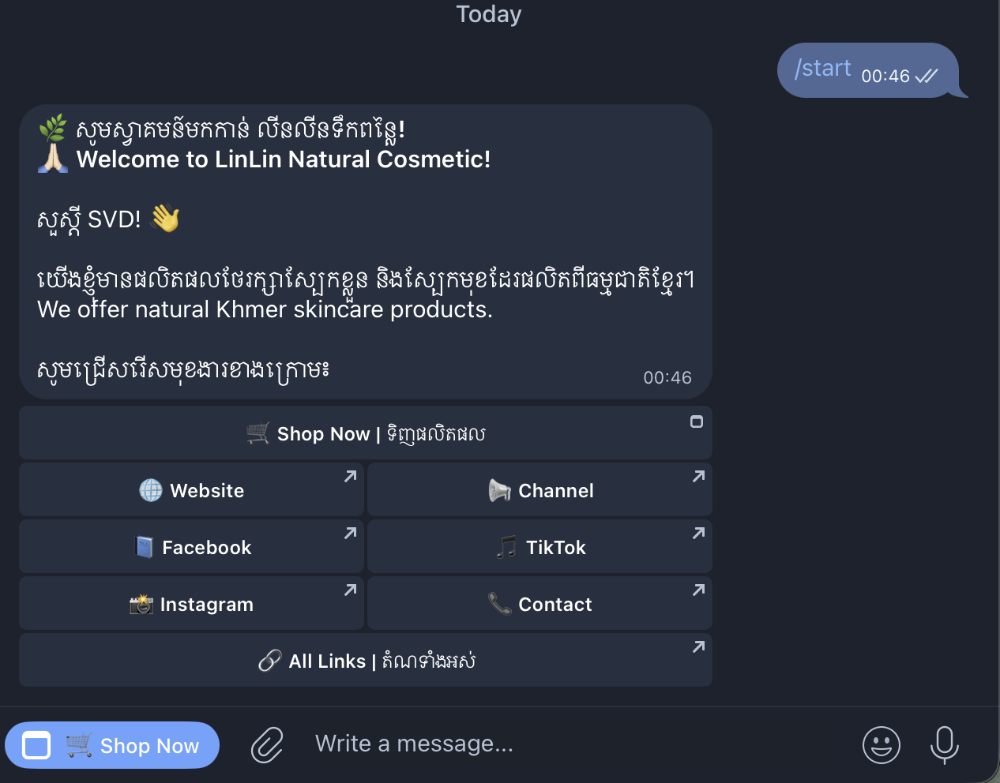
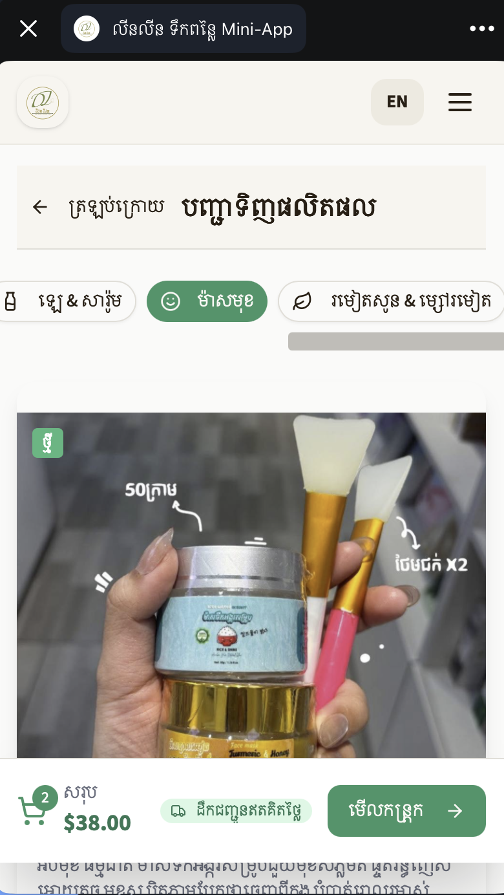
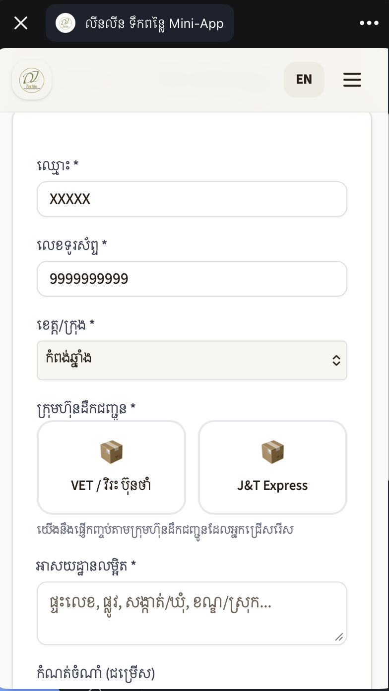
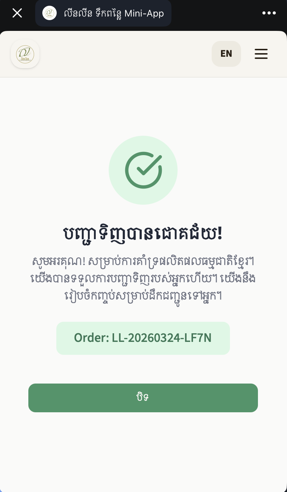
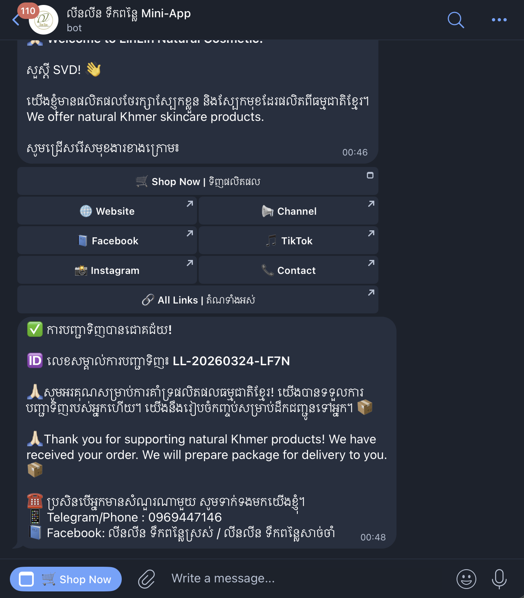

# 🌿 LinLin Natural Cosmetic

> ផលិតផលថែរក្សាស្បែកធម្មជាតិខ្មែរ | Natural Khmer Skincare Products

A modern e-commerce showcase website with integrated Telegram Mini App for seamless product ordering. Built for LinLin Natural Cosmetic (លីនលីន ទឹកពន្លៃ), featuring bilingual support (Khmer/English), real-time order notifications, and a complete checkout flow.


<!-- TODO: Add banner image (1200x630px recommended) -->

## 🔗 Live Demo

| Platform            | Link                                                     |
| ------------------- | -------------------------------------------------------- |
| 🌐 **Website**      | [linlinterkpley.com](https://linlinterkpley.com)         |
| 🤖 **Telegram Bot** | [@linlin_skincare_bot](https://t.me/linlin_skincare_bot) |
| 📱 **Mini App**     | [Open Shop](https://t.me/linlin_skincare_bot/shop)       |
| 📢 **Channel**      | [@Haosreylin](https://t.me/Haosreylin)                   |

---

## ✨ Features

### 🛍️ Showcase Website

- **Responsive Design** - Optimized for mobile, tablet, and desktop
- **Bilingual Support** - Khmer (ខ្មែរ) and English language toggle
- **Product Catalog** - Organized by categories with filters
- **Product Details** - Modal view with full descriptions and images
- **Smooth Animations** - Framer Motion powered transitions

### 📱 Telegram Mini App

- **Native Experience** - Runs seamlessly inside Telegram
- **Full Checkout Flow** - Cart → Customer Info → Payment → Confirmation
- **QR Payment** - Integrated QR code for easy bank transfers
- **Transaction Upload** - Photo upload for payment verification
- **Haptic Feedback** - Native feel with vibration responses

### 🤖 Telegram Bot Integration

- **Welcome Menu** - Interactive buttons for shop, contact, and social links
- **Order Notifications** - Real-time order details sent to staff group
- **Customer Confirmation** - Automatic order confirmation to customers
- **Commands** - `/start`, `/shop`, `/contact`, `/links`

### 💰 Business Features

- **Promotion System** - Configurable discounts with date ranges
- **Delivery Calculator** - Different rates for Phnom Penh vs provinces
- **Logistics Selection** - VET and J&T Express options
- **Staff Dashboard** - Orders sent directly to Telegram group

---

## 📸 Screenshots

### Website Showcase

| Homepage                                       | Products                                           | Product Detail                                 |
| ---------------------------------------------- | -------------------------------------------------- | ---------------------------------------------- |
|  |  |  |

<!-- TODO: Add screenshot images (375x812px for mobile, 1440x900px for desktop) -->

### Telegram Mini App

| Shop                                               | Cart                                               | Checkout                                                   | Confirmation                                       |
| -------------------------------------------------- | -------------------------------------------------- | ---------------------------------------------------------- | -------------------------------------------------- |
|  |  |  |  |

<!-- TODO: Add Mini App screenshot images -->

### Staff Order Notification



<!-- TODO: Add order notification screenshot -->

---

## 🛠️ Tech Stack

### Frontend

- **React 18** - UI library
- **TypeScript** - Type safety
- **Vite** - Build tool
- **Tailwind CSS** - Styling
- **Framer Motion** - Animations
- **Lucide React** - Icons

### Backend

- **Node.js** - Runtime
- **Express** - Server framework
- **Telegram Bot API** - Bot & Mini App integration
- **Multer** - File uploads

### Deployment

- **Railway** - Hosting platform
- **Cloudflare** - DNS & domain management
- **GitHub** - Version control

---

## 📁 Project Structure

```
linlin_website_showcase/
├── client/                  # Frontend React app
│   ├── public/
│   │   ├── products/        # Product images by category
│   │   ├── logo.png         # Store logo
│   │   └── qr-payment.jpeg  # Payment QR code
│   └── src/
│       ├── components/      # React components
│       │   ├── Navbar.tsx
│       │   ├── HeroSection.tsx
│       │   ├── ProductCard.tsx
│       │   ├── ProductDetailModal.tsx
│       │   └── ...
│       ├── contexts/        # React contexts
│       │   └── LanguageContext.tsx
│       ├── lib/             # Utilities & config
│       │   ├── products.ts      # Product data
│       │   ├── store-config.ts  # Store settings
│       │   ├── promotions.ts    # Discount settings
│       │   └── telegram.ts      # Telegram utilities
│       ├── pages/
│       │   ├── Home.tsx     # Showcase homepage
│       │   └── Order.tsx    # Mini App order page
│       └── App.tsx
├── server/                  # Backend Express server
│   └── index.ts             # Server, bot & API routes
├── package.json
└── README.md
```

---

## ⚙️ Configuration

### Store Settings

Edit `client/src/lib/store-config.ts`:

```typescript
export const STORE_CONFIG = {
  name: "LinLin Natural Cosmetic",
  nameKh: "លីនលីន ទឹកពន្លៃ",
  telegramUsername: "linlin_skincare_bot",
  telegramContact: "https://t.me/+855969447146",
  telegramChannel: "https://t.me/Haosreylin",
  telegramMiniApp: "https://t.me/linlin_skincare_bot/shop",
  facebook: "https://www.facebook.com/...",
  // ... more settings
};
```

### Promotion System

Edit `client/src/lib/promotions.ts`:

```typescript
export const PROMOTION = {
  enabled: true, // Toggle ON/OFF
  discountPercent: 10, // 10%, 20%, etc.
  startDate: "2026-03-23",
  endDate: "2026-04-23",
  // ... more settings
};
```

### Server Configuration

Edit `server/index.ts`:

```typescript
const CONFIG = {
  TELEGRAM_BOT_TOKEN: "your-bot-token",
  STAFF_GROUP_ID: "-1001234567890",
  WEBSITE_URL: "https://linlinterkpley.com",
  // ... more settings
};
```

---

## 🚀 Getting Started

### Prerequisites

- Node.js 18+
- npm or yarn
- Telegram Bot Token (from [@BotFather](https://t.me/BotFather))

### Installation

1. **Clone the repository**

```bash
git clone https://github.com/virakden/linlin_website_showcase.git
cd linlin_website_showcase
```

2. **Install dependencies**

```bash
npm install
```

3. **Configure environment**
   - Update `server/index.ts` with your Telegram bot token
   - Update `client/src/lib/store-config.ts` with your store info

4. **Run development front-end**

```bash
npm run dev | pnpm dev
```

5. **Open in browser**

```
http://localhost:3000        # Showcase website
http://localhost:3000/order  # Mini App page
```

### Build for Production

```bash
npm run build | pnpm build
npm start
npx tsx server/index.ts
```

---

## 📱 Telegram Bot Setup

### 1. Create Bot

- Message [@BotFather](https://t.me/BotFather)
- Send `/newbot` and follow instructions
- Save the bot token

### 2. Create Mini App

- Message [@BotFather](https://t.me/BotFather)
- Send `/mybots` → Select your bot
- Go to **Bot Settings** → **Menu Button**
- Set URL: `https://your-domain.com/order`

### 3. Set Bot Commands

Send to @BotFather:

```
/setcommands

start - Start the bot
shop - Open the shop
contact - Contact us
links - All our links
```

### 4. Create Staff Group

- Create a Telegram group for receiving orders
- Add your bot as admin
- Get group ID (send message, check via API)
- Update `STAFF_GROUP_ID` in server config

---

## 🌐 Deployment (Railway)

### 1. Push to GitHub

```bash
git add .
git commit -m "Ready for deployment"
git push origin main
```

### 2. Deploy on Railway

- Go to [railway.app](https://railway.app)
- Create new project from GitHub repo
- Railway auto-detects and deploys

### 3. Add Custom Domain

- In Railway: Settings → Networking → Add Custom Domain
- In Cloudflare: Add CNAME record pointing to Railway

---

## 📝 Environment Variables

| Variable             | Description                          |
| -------------------- | ------------------------------------ |
| `PORT`               | Server port (default: 3000)          |
| `NODE_ENV`           | Environment (development/production) |
| `TELEGRAM_BOT_TOKEN` | Bot token from BotFather             |
| `STAFF_GROUP_ID`     | Telegram group ID for orders         |

---

## 🤝 Contributing

Contributions are welcome! Please feel free to submit a Pull Request.

---

## 📄 License

This project is licensed under the MIT License - see the [LICENSE](LICENSE) file for details.

---

## 👨‍💻 Author

**Virak Den**

- GitHub: [@virakden](https://github.com/virakden)

---

## 🙏 Acknowledgments

- [Telegram Bot API](https://core.telegram.org/bots/api)
- [Telegram Mini Apps](https://core.telegram.org/bots/webapps)
- [Railway](https://railway.app) for hosting
- [Cloudflare](https://cloudflare.com) for DNS

---

<p align="center">
  Made with ❤️ in Cambodia 🇰🇭 by DEN_DOMAIN
</p>
```

---
